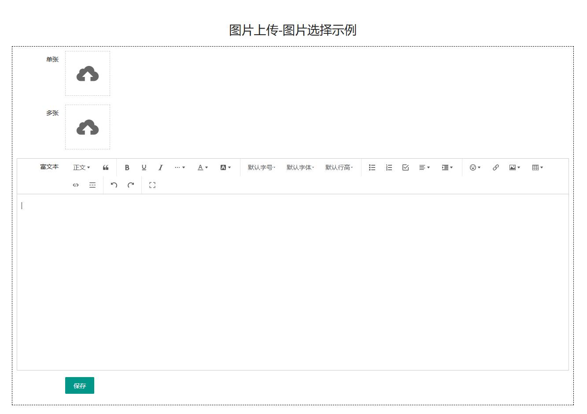
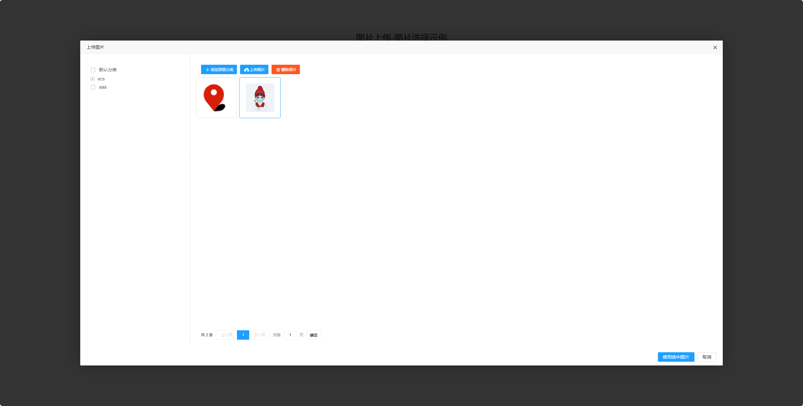
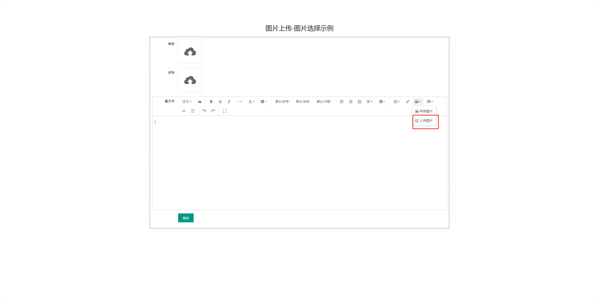

**为什么要写图片选择器**

最近在项目中使用到多处需要上传图片的地方，并且公司 人手有限，身为后端的我就不得不全栈开发了，作为后端的我们实现图片上传很简单，但是运营一旦上传了错误的图片那么就得重新上传，那错误的图片就留在了服务器上，这样做显然会给服务器带来不必要的空间消耗，同时运营操作起来也不方便，比方说一张图片会在多个地方使用，如果每次都上传一次这个图片，显然也会给服务器硬盘带来存储压力，我在市面上没有找到一个适用于PHP封装的图片选择器，所以，当我写完后就想着造福大家，当然我这个也需要您认真看一下。如果您是PHPer并且您会Laravel，那这个对您来说用起来将会非常方便。

**技术背景**

`Larvel6.0+Vue3+jquery+wangEditor5.0`

**项目演示**

1. 克隆项目

   `git clone https://github.com/zhouyanchuang/laravel-image-hosting.git`

2. 进入项目根目录

   `php artisan key:generate`

3. 生成软连接 根目录下运行

   `php artisan storage:link`

4. 设置自动加载 根目录下运行

   `composer dump-autoload`

5. 在项目根目录下有一个image-hosting.sql文件导入到你的数据库

6. 在.env中配置你的数据库信息

7. 在你的集成环境中配置项目

8. 浏览器访问`你配置的域名/admin/index`查看演示





**富文本中使用**



**代码中使用**

1、点击图标选择图片

```
{{utils_select_image('test1','test1Name')}}
utils_select_image方法有4个参数
第一个是vue实例化的id
第二个是隐藏input的name，用来给后端传值，值是以逗号分割的图片路径
第三个是限制最多选择几张图片(int类型，默认是1)
第四个是默认值，用来修改页面的图片初始化值的格式是数组
示例值：[['url'=>'/storage/2024/06/14/10/27/1686706316.png']]，记得json_encode
```

2、富文本使用

```
{{utils_wange_editor('content')}}
utils_wange_editor有两个参数
第一个是隐藏的textarea的name和vue实例化的id,用来给后端传值
第二个是默认值，用来初始化富文本框中的内容
```

